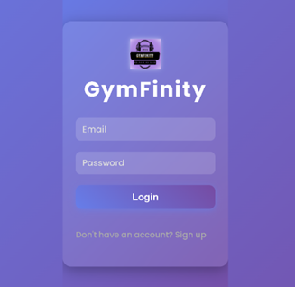
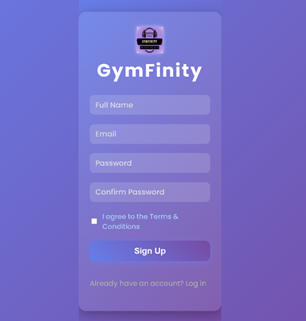
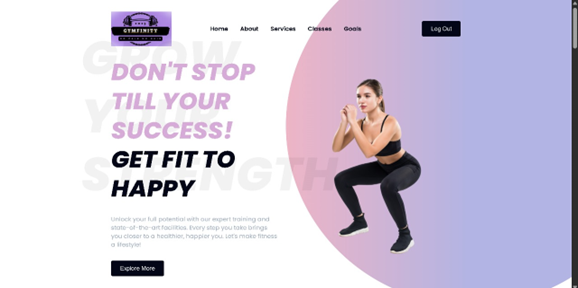
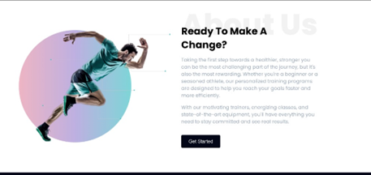
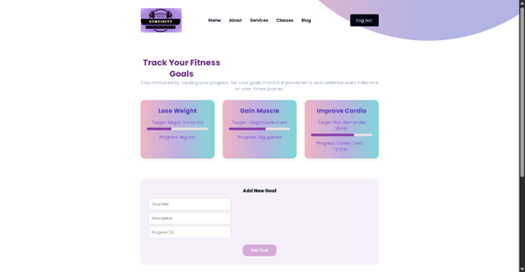
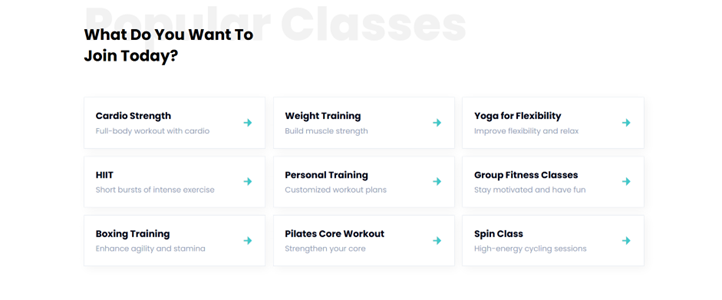
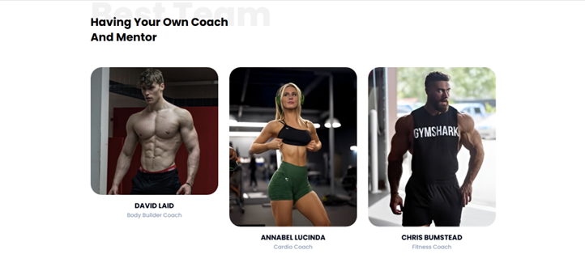

# 🏋️‍♂️ GymFinity – Fitness & Goal Tracking Platform  


A **modern, responsive, and interactive web app** designed to help users **track fitness goals, manage progress, and stay motivated**.  
Built with **HTML, CSS, and JavaScript**, GymFinity provides a sleek interface and dynamic functionality that feels like a real premium fitness platform.  

---

## ✨ Features  

- 🏃 **Goal Tracking Dashboard** – Create, edit, and manage your fitness goals.  
- 📊 **Progress Analytics** – Visualize progress with interactive charts.  
- 🎯 **Milestone Rewards** – Unlock motivational rewards when goals are achieved.  
- 🔑 **Authentication Page** – Simple login & signup system UI.  
- 📱 **Responsive Design** – Fully optimized for desktop & mobile devices.  
- 🎨 **Modern UI/UX** – Styled with animations and a premium theme.  
- 🚀 **Explore & Get Started** – Seamless navigation between pages.  

---

## 🖥️ Tech Stack  

- **Frontend**: HTML5, CSS3, JavaScript (Vanilla JS)  
- **UI/UX**: ScrollReveal animations, interactive forms  
- **Deployment**: GitHub Pages

---

## 📂 Project Structure  

```bash
GymFinity/
│── assets/               # Images, icons, and other assets
│── auth.html             # Login / Signup Page
│── goal-tracking.html    # Goal Tracking Dashboard
│── index.html            # Home Page
│── main.js               # JavaScript functionality
│── styles.css            # Global Styles
│── README.md             # Documentation
```

---

## 🚀 Setup Instructions  

### 1. Clone the Repository  
```bash
git clone https://github.com/sanjayKumarR-404/FitnessClubWebpage.git
cd GymFinity
```

### 2. Open the Project  
Simply open `index.html` in your browser to view the app.  

*(Optional: Use a local server like Live Server in VS Code for better experience)*  

---

## 📸 Screenshots  

- 🖼️ *LogIn Page*  
    

- 🖼️ *SignIn Page*  
    

- 🖼️ *Home Page*  
    

- 🖼️ *About Page*  
  

- 🖼️ *Goal Tracking Page*  
  

- 🖼️ *Classes Page*  
    

- 🖼️ *Mentor Page*  
  

*(... and many more pages such as Services, Classes, Contact, etc.)*  


---


## 👨‍💻 Author  

**Sanjay Kumar R**  
Bachelor of Engineering (B.E.) in Computer Science Engineering (2023 - 2027)  
Email: rsanjaymail@gmail.com  
LinkedIn: [linkedin.com/in/SanjayKumarR20082005/](https://linkedin.com/in/SanjayKumarR20082005/)  
GitHub: [@sanjayKumarR-404](https://github.com/sanjayKumarR-404)  
